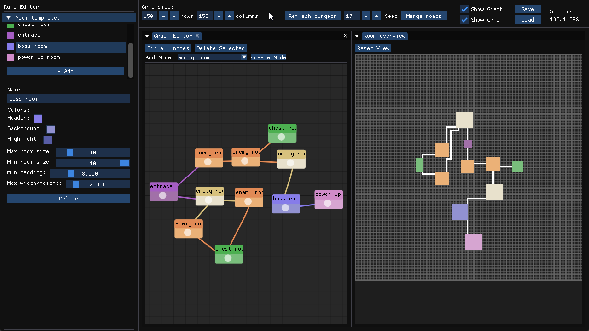
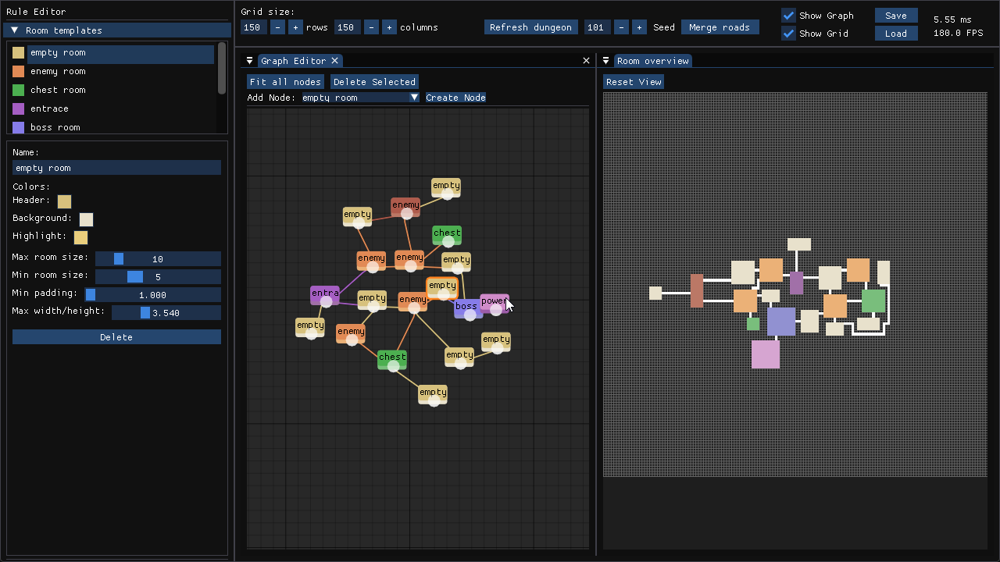

# Creating a tool for procedurally generating dungeons from a graph

**January 16, 2026 · 10 min read** 
By Ciobanu Ana Maria
---

## Table of Contents
1. [Preamble](#preamble)
2. [Tool Structure](#tool-structure)
3. [Dungeon Generation Using a Graph as a Starting Point](#dungeon-generation-using-a-graph-as-a-starting-point)
   - [Generating the Dungeons](#generating-the-dungeons)
   - [Placing the Rooms](#placing-the-rooms)
   - [Pulling the Rooms Together](#pulling-the-rooms-together)
   - [Creating the Roads](#creating-the-roads)
4. [Dungeon Editor Functionality](#dungeon-editor-functionality)
5. [Using the Library](#using-the-library)
6. [Limitations](#limitations)
7. [Conclusion](#conclusion)
   - [Future Work](#future-work)
8. [Resources and Further Reading](#resources-and-further-reading)

---

 <div style="text-align: center;">
  <video width="426" height="240" controls>
    <source src="assets/tool.gif" type="video/mp4">
  </video>
  <figcaption>Demo of the dungeon generation tool in action</figcaption>
</div>

We are all familiar with the classic rogue-like, procedurally generated dungeons and their timelessness in games. There are, of course, countless methods you can use to generate such levels, all having different complexities and final aspects that can be tailored for specific outputs. But what would a more general approach be ? This article will go over the process of developing a tool for procedural dungeon generation: how to create a framework that allows for quick testing and concepting with enough control of the overall level. 

## Preamble

Researching various algorithms for dungeon generation, I stumbled upon [this article by BorisTheBrave](https://www.boristhebrave.com/2019/07/28/dungeon-generation-in-enter-the-gungeon/) which goes over the method the developers of Enter the Gungeon used for the level generation. In order to preserve a certain flow or "feel" of the levels across multiple runs, the dungeons are formed based on flowcharts. Pre-made rooms are placed randomly, respecting this graph and following a relatively straightforward algorithm, where the flowchart is split into multiple compounds of rooms, first fitting the rooms in a compound together, and then the resulting structures with one another. 
I found a graph to be a great base for generating a dungeon, as it can be a useful data structure for keeping track of the players progression through the level, but, most importantly, it provides control over how the level feels and it can give more of a "handcrafted" look. Starting from this, I decided to try and develop a tool that focuses on providing the logic necessary for easily generating a level based on a graph, as well as sufficient control over its aspect. 


## Tool structure

One of the most important things to take into account when developing a tool is its structure: what are the elements you will need, how will they interact with each other, what should be available to the user and so on. 

So what do we need in our case ?
First of all, it's important to make the separation between the actual logic for generating the dungeons, the algorithms themselves, and the functionality that will make our program into a tool that others can use with ease. Based on this, the project should be split into two parts: a library responsible only for generating the levels and an editor, a separate project that offers a debug output and a user interface that allows for easy interaction with the tool.

This is an overview of my project structure:

```cpp
dungeon_tool_project/
├─ dungeon_tool/    // this is a static library that contains the dungeon generation logic
│  ├─ DungeonTool // here we will define the Dungeon struct and DungeonTool functions
│  ├─ DungeonHelper  // contains a random number generator and some other helper functions such as AABB collision detection
├─ dungeon_editor/  // this is our editor, a separate project that runs independently 
│  ├─ main
│  ├─ DungeonEditor  
│  ├─ GraphEditor
│  ├─ GridEditor
│  ├─ WindowManager  // here is all the logic regarding the UI and setting the parameters that the tool will use
```

Let's also talk about how the library is structured, as it is necessary to provide a clear enough interface for its functionality.

The structures we will be working with are the following: 

Dungeon : the main object the user can work with

 -  Contains:
     - a vector of rooms;
    - a vector of paths; (a structure that simply contains the ids of the two rooms it connects)
    - a pointer to a grid;
    - a vector of room rules templates; ( a structure that stores information about room aspect rules such as size or how isolated it is.)

Room : structure providing information about the rooms

 -  Contains:
    - center position
	- adjacency list;
	- bounding box; (another structure that stores information about the size and shape of the room, this one referring to the current aspect)
	- a room rules template id which corresponds to the position in the room rules vector in the dungeon structure. 

Grid : a structure made of cells which contain useful information such as the room id or path id of the object currently occupying the cell.

DungeonTool : a class that contains all the functions that can be used for dungeon generation, most important being GenerateDungeon(dungeon) a function we can call on our dungeon object to make it store a valid procedurally generated level.

## Dungeon generation using a graph as a starting point

Now let's go over the most important functions in the dungeon_tool library

### Generating the dungeons

We will create a loop that keeps trying to find a layout until a valid one is reached: 

```cpp
bool tryAgain = true;
while (tryAgain) {
    dungeon.grid->ClearGrid(); //clear the previous layout
	GenerateBoundingBoxes(dungeon); //assign random sizes to the rooms
	PlaceRooms(dungeon); //place the rooms randomly without any overlaps or road intersections
	PullRoomsTowardsPoint(dungeon, glm::ivec2(0, 0)); //pull everything towards the middle of the grid
	// !! after this step make sure to mark the grid cells with the corresponding room id
	bool valid = false, found = false;
	int tries = 0; //limit the tries with each layout
	while (!valid && tries < 3) {
		valid = true;
		for (int i = 0; i < dungeon.paths.size(); i++) {
			int idA = dungeon.paths[i].indexA;
			int idB = dungeon.paths[i].indexB;
			glm::vec2 nearestA = DungeonHelper::GetNearestPointOnBoundary(/*roomB boundary*/ );
			glm::vec2 nearestB = DungeonHelper::GetNearestPointOnBoundary(/*roomA boundary*/);
			Cell a(nearestA.y + dungeon.grid->GetRowNumber() / 2,
					nearestA.x + dungeon.grid->GetColumnNumber() / 2);
			Cell b(nearestB.y + dungeon.grid->GetRowNumber() / 2,
					nearestB.x + dungeon.grid->GetColumnNumber() / 2);
            //make sure the cells use the grid reference system with (0,0) at the top left
			std::vector<int> safeIds;
			safeIds.push_back(idA);
			safeIds.push_back(idB); 
            //the roads will start from the rooms, so add the room ids the the safeIds to list
            // to tell the connection algorithm they don't need to be avoided
			if (!ConnectTwoPointsOnGrid(*dungeon.grid, a, b, i, safeIds)) {
				valid = false;
				tries++;
			}
		}
		if (valid) found = 1;
	}
	if (found) tryAgain = false;
}
```

### Placing the rooms

I initially tried to adapt the Enter the Gungeon algorithm for my purposes, but I realized it may be quite difficult to determine what is a good compound to chose when there are an unpredictable amount of loops and connections between rooms, so I decided to try out a simple algorithm that tries to spawn in rooms in such a way that there are no collisions and no road intersections. The rooms were generated to be rectangles of random sizes. This is an outline of the algorithm I used: 

```
-loop over every room and try to place in a random position in a circle of radius R
--if the room overlaps with another room that has already been placed, spawn it in a
different position, increase the spawning radius and try again

-loop over all the rooms adjacent to the current one and over all the paths 
(that are not connected to the current room or adjacent room )
--if the road between the current room and it's adjacent is intersecting any other road
increase the spawning radius and try again.
--if the spawning radius reached the maximum spawning radius set or the loop count gets too large,
retry the room placing from a different position. 
```
This is not an ideal algorithm, but it performed fine for small scale dungeons.

In order to improve the performance, as well as avoid infinite searches that are easily created when increasing the road count while using a brute force algorithm, I opted to use OGDF: an open source library for graph drawing. It has a lot of different algorithms for planar graph embedding, which, if you've never heard of it, it is exactly what we were doing in the previous algorithm, but with a mathematical approach instead of brute force. A planar graph is a graph that can be translated to a plane without any edges intersecting and embedding a graph refers to actually drawing out the graph. There are multiple algorithm that can be used for this and OGDF covers all of the well known ones. The downside to this library is its size, which is quite large and requires building. However, it is a trade off for more performance, scalability and flexibility regarding the algorithm used if that is desired.

I chose to use the SpringEmbedderFRExact algorithm as a base, as it offers some minimal randomization, customization and is relatively fast, but the algorithms the library provides are plentiful. Similar to the other energy based algorithms it provides somewhat randomized results that we will then process to achieve a more "organic" look.

First initialize the graph nodes and edges:
```cpp
ogdf::Graph G;
std::vector<ogdf::node> v;
for (size_t i = 0; i < dungeon.rooms.size(); i++) {v.push_back(G.newNode(i));} 
std::vector<ogdf::node> e;
for (auto &[indexA, indexB]: dungeon.paths) {	G.newEdge(v[indexA], v[indexB]);}
ogdf::GraphAttributes GAtr(G, ogdf::GraphAttributes::nodeGraphics | ogdf::GraphAttributes::edgeGraphics);
```

Add the node sizes to the structure and make note of the average room size
```cpp
int avg = 0;
for (size_t i = 0; i < dungeon.rooms.size(); i++) {
	const ogdf::node node = v[i];
	auto currentRoomRule = dungeon.roomRules[dungeon.rooms[i].rules];
	GAtr.x(node) = randGen.GetRandomFloatInRange(-5000, 5000);
	GAtr.y(node) = randGen.GetRandomFloatInRange(-5000, 5000);
	avg += currentRoomRule.maxSize + currentRoomRule.minPadding;
	GAtr.width(node) = currentRoomRule.maxSize + currentRoomRule.minPadding;
	GAtr.height(node) = currentRoomRule.maxSize + currentRoomRule.minPadding;
}
if (avg > 0) avg /= dungeon.rooms.size();
```
Then, call the spring embedder algorithm. Other algorithms can be called and adjusted in similar ways. The average room size is used to space out the rooms. This is needed because we will apply random offsets to them and we don't want to risk an overlap.

```cpp
ogdf::SpringEmbedderFRExact spring; 
spring.iterations(10);
spring.idealEdgeLength(10.0 * avg);
spring.minDistCC(10.0 * avg);
spring.noise(true);
spring.call(GAtr);
```
Determine the center of mass of all the nodes so the dungeons can be placed at the middle of the grid	
```cpp
glm::vec2 centerOfMass(0.0f, 0.0f);
for (const ogdf::node node: G.nodes) {
	centerOfMass.x += GAtr.x(node);
	centerOfMass.y += GAtr.y(node);
}
centerOfMass /= static_cast<float>(G.nodes.size());
```

Finally, place the rooms around the middle of our grid (0,0) and offset the rooms randomly. I do this based on the room size multiplied by an offset so that there is sufficient randomness without risking the rooms overlapping.

```cpp
for (const ogdf::node node: G.nodes) {
  auto currentRoomRule = dungeon.roomRules[dungeon.rooms[node->index()].rules];
  dungeon.rooms[node->index()].center.x = GAtr.x(node) - centerOfMass.x;
  dungeon.rooms[node->index()].center.y = GAtr.y(node) - centerOfMass.y;
  dungeon.rooms[node->index()].center += 
  glm::vec2(randGen.GetRandomFloatInRange(-currentRoomRule.maxSize * 3, currentRoomRule.maxSize * 3), 
  randGen.GetRandomFloatInRange(-currentRoomRule.maxSize * 3, currentRoomRule.maxSize * 3));
}
```
<div style="text-align: center;">
  <video width="426" height="240" controls>
    <source src="assets/nopulling.mp4" type="video/mp4">
  </video>
  <figcaption>This is how the output should like now, with road generation but no further room processing</figcaption>
</div>

### Pulling the rooms together  

After the rooms are laid out quite far apart and at random positions, we can pull them towards the middle of the grid using something like this: 

Start by looping over all the rooms. I sorted the rooms based on their distance to the point they are pulled towards, but it is not necessary. If you choose to do this, store the sorted indices, don't change the actual order in the rooms vectors.

For each loop do the following:
```cpp
int i = sortedIndices[idx];
somethingChanged = true;
int iterations = 0; //have a limited amount of iterations
	while (somethingChanged && iterations < 1000) { 
		iterations++;
		somethingChanged = false;
		auto velocity = glm::vec2(0);
		if (p.y == dungeon.rooms[i].center.y)
			velocity.y = 0;
		else
			velocity.y = (p.y > dungeon.rooms[i].center.y)
				? 1 * randGen.GetRandomFloatInRange(0, dungeon.rooms.size())
				: -1 * randGen.GetRandomFloatInRange(0, dungeon.rooms.size());
		... //same thing for velocity.x

// have a random velocity pulling the rooms in the correct direction.
// the more rooms, the more empty space, so the more aggressive the pull 
		bool noCol = true;
		for (int j = 0; j < dungeon.rooms.size(); j++) {
		  if (i != j) {
			  if (AABBCollision(-dungeon.rooms[i],dungeon.rooms[j]))  noCol = false;
		  }
		}// make sure there are no overlaps
		if (noCol && ((static_cast<int>(dungeon.rooms[i].center.y) < p.y) ||
				static_cast<int>(dungeon.rooms[i].center.y) > p.y ||
				(static_cast<int>(dungeon.rooms[i].center.x) < p.x) ||
				static_cast<int>(dungeon.rooms[i].center.x) > p.x)) {
					dungeon.rooms[i].center += velocity;
					somethingChanged = true;
		}//if the room is not in the middle and no collision has been found, keep going

// you can also add another check for distance from the middle, as some collisions
// may be encountered to early on. This way you can force a more compact dungeon
}
```
### Creating the roads
The road generation algorithm is an A* search with custom heuristics, which prioritizes a strictly horizontal move when possible. This is done by reducing the heuristics by an arbitrary number so that a move in the same direction is preferred when possible.

We will need a priority queue for the grid cells that still need to be visited, a vector that keeps track of the cells already visited (we choose this over a hash table as the grid can get quite big and we would store an unnecessary amount of data as we would likely not visit that many cells in our search )

``` cpp
std::map<std::pair<int, int>, std::pair<int, int> > parent;
std::vector<bool> visited(grid.GetGridSize(), false);
std::priority_queue<std::pair<int, std::pair<int, int> >,
std::vector<std::pair<int, std::pair<int, int> > >,decltype(cmp)> pq(cmp);
```
Make sure to initialize everything and add a maximum number of iterations in case a path cannot be found. Then begin the main while loop:

``` cpp
while (!pq.empty() && iterations < maxIterations) {
	iterations++;
	auto [dist, coords] = pq.top();
	pq.pop();
	Cell current(coords.first, coords.second); 
//the current cell becomes the top of the priority queue

	if (current.row == pointB.row && current.col == pointB.col) { 
        ...
	// if the destination is found trace the road back through the parents
        //don't forget to mark the cells
	}

	const int rowDiff = pointB.row - current.row;
	const int colDiff = pointB.col - current.col;
	if (CheckUpwardCell(grid, current, safeIDs)) {
		if (Cell next(current.row + 1, current.col); grid.GetCellKey(next) < visited.size())
			if (visited[grid.GetCellKey(next)] == 0) {
				visited[grid.GetCellKey(next)] = true;
				parent[{next.row, next.col}] = {current.row, current.col};
				int heuristic = abs(next.row - pointB.row) + abs(next.col - pointB.col);
				if (rowDiff > 0) heuristic -= 4;
				pq.push({heuristic, {next.row, next.col}});
			}
		}
    //if the cell is "valid", in this case:
    // - it is not overlapping another room or path 
    // - it is one cell away from any other path 
    // (be careful to omit the already marked cells from the check)
    // - it has not been visited
    // add it to the map, compute the heuristics based on the distance improvement
    // and, if the destination row or column hasn't been reached, decrease the
    // heuristics by an arbitrary number. This is to prevent zig-zag roads and 
    // prefer a cell that continues a straight line. Four just looked best

    ... //(repeat the same logic for the down/left and right cells)		
}
return {}; // No path found
	
```

## Dungeon editor functionality

<div style="text-align: center;">
  <video width="426" height="240" controls>
    <source src="assets/adding_template.mp4" type="video/mp4">
  </video>
  <figcaption>Adding a room template</figcaption>
</div>

For the dungeon_editor we can create a separate project that will use our newly created dungeon_tool library. This project will serve as a user interface for creating the base graph, setting rules for the dungeon and visualizing the output. For this part I chose to use SDL2, ImGui and ImGuizmo for displaying the graph. 
The room templates provide some basic variation to the room size, its aspect ratio and how isolated it is from other rooms. These rules can be greatly expanded, but the structure provided should serve as a solid skeleton. 
The graph editor expands and changes the ImGuizmo GraphEditor, adding functionality like deleting nodes and links, as well as making them be unidirectional to better serve the purpose of the tool. 
The grid editor just renders the grid according to the information stored in dungeon->grid

## Using the library 

One more important step is adding serialization. Because we want the user to tweak the input data for our generation algorithms in the editor we need to save and store them. Both the tool and editor should be able to save and load appropriate data in order to save the user progress. 

The tool should be able to save and load a dungeon structure containing: 
- the vector of rooms (only the room template index and adjacency list are important here) 
- an empty grid and its size
- the room templates vector

The editor should save and load:
- the graph node positions
- the room template color settings

After linking the library to a project it can be used as such:
```cpp
#include"DungeonTool.h"

dungeon_tool::Dungeon dungeon;
//create a dungeon structure 
dungeon_tool::DungeonTool::LoadDungeon(dungeon);
// Load a dungeon template previously created with the editor
// make sure to copy the dungeon_data.json file to your project
dungeon_tool::DungeonTool::SetSeed(seed);
// you can set a specific seed or just let the dungeons be random
dungeon_tool::DungeonTool::GenerateDungeons(dungeon);
// call this on the dungeon structure to place the rooms and roads
dungeon_tool::DungeonTool::MergeRoads(*dungeon.grid);
// here I created some extra functionality for merging roads that are close by
// any other functionality you would like to add should be in DungeonTool and 
// edit the dungeon structure provided
dungeon.grid->cells[i].roomId
// you can access data stored in the cells structure, such as 
// the room or path that is currently occupying that space
dungeon.rooms[dungeon.grid->cells[i].roomId] 
// or room/path data like this
 ```

 <figure style="text-align: center;">

  <div style="text-align: center;">
  
  
</div>
</figure>

<figure style="text-align: center;">

  <div style="text-align: center;">
  
  
</div>
  <figcaption>Some possible outputs shown in the editor </figcaption>
</figure>


## Limitations

 The current bottleneck is the road generation algorithm. Even if the SpringEmbedder algorithm returns a layout where roads are guaranteed to not intersect, this may not remain true after pulling the rooms together, taking longer to find a valid layout. Finding a path through the grid also take a bit of time, especially when the paths aren't as straightforward anymore. Considering this, the tool can load around 11 rooms with 12 connections on a 150 by 150 cell grid every frame at ~40 ms (for comparison using the brute force approach takes around 500 ms for 10 rooms with 10 connections). From then on the loading time starts increasing, especially when adding connections or loops between rooms.

## Conclusion 

 In the end, this project offered me a lot of insight when it comes to designing a tool, as well as some of the algorithms behind procedurally generated dungeons and I hope to have shared some of that. Working on this project as part of my university studies and having a limited time frame didn't allow for too much work in regards to pushing the limits of the flexibility and control such a tool can offer, however I tried to provide a solid skeleton that can be easily expanded upon in the future. 

### Future work

 - Adding a more complex set of rules to the rooms
 - Populating the rooms with objects
 - Procedurally generating the base graph

## Resources and further reading 

 - <https://www.boristhebrave.com/2019/07/28/dungeon-generation-in-enter-the-gungeon/>
 - <https://ics.uci.edu/~eppstein/gina/schnyder/>
 - <https://cs.brown.edu/people/rtamassi/gdhandbook/chapters/straightline.pdf>
 - <https://www.ogdf.uni-osnabrueck.de/>